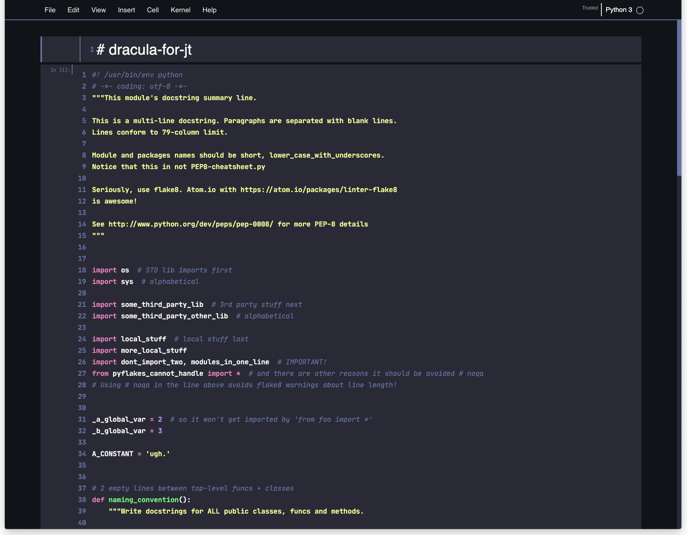

# dracula-for-jt

Dark style/theme for [jupyter-themes](https://github.com/dunovank/jupyter-themes) based on [Darcula theme](https://draculatheme.com/)



## Installation
- Copy **darcula.less** file to _{jupyter-themes folder}/style_ directory.
- run ```jt -t darcula``` 
